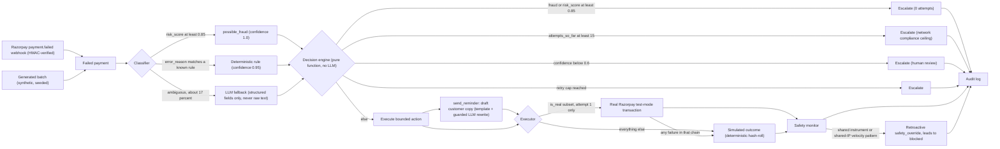

# Paymedic

An AI Revenue Recovery agent built for the **Razorpay AI Buildathon**. It detects at-risk
revenue (failed payments), classifies why each one failed, and executes a bounded, fully
audited recovery action — with hard stopping rules a real payment system is legally and
financially forced to respect, not invented ones.

## The problem

> Build an agent that detects at-risk revenue (failed payments, abandoned checkouts,
> overdue invoices) and executes a bounded recovery workflow.
> — Razorpay AI Buildathon, "AI Revenue Recovery" track

The judged bar: actual money recovered on a batch (not a cherry-picked example),
explainable/bounded/gated actions, stopping rules (max retries, no action on fraud),
a full audit trail per transaction, and at least one deliberate "the agent was wrong,
and caught itself" case.

Paymedic's scope: **payment failure → root-cause classification → bounded recovery
action → audit log**, run over a full batch, with every decision explainable after
the fact.

**Stated plainly:** the track names three at-risk-revenue sources — failed payments,
abandoned checkouts, overdue invoices. This build covers the first only. That was a
deliberate choice to go deep on one rather than shallow on three: the governance
problem (stopping rules, fraud gating, calibration, auditability) is the same in all
three, and it is where naive implementations actually fail. Abandoned checkouts and
overdue invoices are not implemented and are not claimed.

## Approach



- **Classification** — deterministic rules cover most transactions; an LLM only ever
  labels the ambiguous ~17%, from structured fields (error code/source/step/amount/
  attempt/latency/risk_score), **never raw free text**, and only ever emits a
  classification label — never a decision or an action.
- **Decision** — a pure function, no LLM in the loop, that only ever sees
  `(root_cause, confidence, risk_score, attempts_so_far)`. This is the sole authority
  on what happens to money.
- **Execution** — a bounded action (`retry_immediate`, `retry_with_backoff`,
  `suggest_alternate_method`, `send_reminder`) is carried out; see
  [Real vs. simulated execution](#real-vs-simulated-execution) below.
- **Safety monitor** — runs after every action, independent of that transaction's own
  outcome, and can retroactively override an already-"recovered" status.
- **Scheduling** — a retry's *timing* is decided separately from its count: day-scale
  attempts are moved out of a quiet window, and an `insufficient_funds` retry is pulled
  onto a nearby salary-credit date. See [Retry timing](#retry-timing).
- **Notification** — a `send_reminder` action drafts the actual customer-facing copy,
  template-first with a guarded LLM rewrite. See [Customer notifications](#customer-notifications).
- **Audit log** — every classification, decision, execution, notification, and safety
  override is logged with reasoning, timestamps, the exact message sent, and (for real
  transactions) the actual gateway response.

## Safety bounds & stopping rules

These are enforced in `backend/app/services/decision_engine.py`, independent of the
LLM, and are visible live in the dashboard's Safety Bounds panel (pulled from
`/config/rules`, not hardcoded):

| Rule | Enforcement |
|---|---|
| Fraud never auto-retried | `risk_score >= 0.85` or `root_cause == possible_fraud` → escalate, 0 attempts ever |
| Network compliance ceiling | `attempts_so_far >= 15` → escalate, citing the real Visa/Mastercard ~15-attempt/30-day reattempt-limit rule |
| Low-confidence classification | `confidence < 0.6` → escalate to human review, never guessed |
| Per-cause retry caps | e.g. `gateway_timeout` capped at 3 attempts, `card_declined` at 1 (redirect, never a same-card retry) |
| Soft/hard decline typing | hard declines (`card_declined`, `possible_fraud`) get zero same-instrument retries, explicit and citable, not just implicit |
| Cross-transaction fraud check | two independent signals — shared payment instrument, and distinct instruments sharing one IP — can retroactively block a transaction even after an individually-reasonable action already "succeeded" |
| Retry timing bounds | no day-scale attempt lands in the 01:00–06:00 quiet window; salary-credit alignment can only pull an attempt forward within a bounded lookahead, never past the 10–14 day envelope |
| Bounded LLM blast radius | the LLM only ever emits a label or rewrites a fixed template; it never decides an action, and every generated message passes a content guard before a customer could see it |

**The flagship "agent was wrong, caught itself" cases**, both always present in every
generated batch: a card-testing cluster (one instrument, 4 small-amount transactions)
that the per-transaction classifier confidently mislabels as ordinary gateway
timeouts, and a distributed variant (4 distinct instruments/customers sharing one IP)
that only the IP-based check can see. Filter the dashboard to `status=blocked` and
open any of those rows to see the full sequence: confident classification → bounded
action → apparent success → red `safety_override` card with the retroactive reasoning.

## Real vs. simulated execution

By default, every recovery action's outcome is **simulated**: a documented
success-probability table (illustrative, not measured — e.g. `gateway_timeout` at
65%/40%/20% across 3 attempts, diminishing because genuine outages don't fix on blind
retry) hashed deterministically per `(transaction_id, attempt_number)`, so re-running
a batch always reproduces the same result. No real gateway is touched.

Optionally (`RAZORPAY_EXECUTION_ENABLED=true`), a small, fixed-count subset of each
batch (default 4, netbanking, soft-decline causes only) has its **first** bounded
action attempted against a genuine Razorpay test-mode transaction instead: a real
order via the Orders API, a headless browser driven through the actual Checkout
widget and mock-bank Success/Failure page, and the outcome read back from Razorpay's
own API (not trusted from the checkout widget's client-side callback, which proved
unreliable under headless automation). Any failure anywhere in that chain — API
error, browser automation breakage, a stuck poll — falls back transparently to the
same simulated outcome every other transaction uses, so a broken/unconfigured
Razorpay account never blocks the pipeline.

This is off by default: a clean clone with no Razorpay keys behaves exactly as the
fully-simulated system always has. The dashboard visibly distinguishes the two —
a **Razorpay Verified** metric tile, and a **REAL** badge on any row/audit event
that actually completed against the real gateway — so nothing is blended invisibly.

Real candidates are processed by a **separate "Run Real Transactions" step**, kept
out of the main "Run Pipeline" batch entirely (`POST /pipeline/run` excludes
`is_real` rows; `POST /pipeline/run-real` handles only them). This is deliberate:
the ~4 real transactions each involve genuine network + browser-automation time, so
interleaving them into the main loop would make "Run Pipeline"'s timing unpredictable
exactly when the feature is on. Verified live: `POST /pipeline/run` stays at ~10s for
the other 96 transactions whether the feature is on or off; `POST /pipeline/run-real`
took ~70s for the 4 real candidates, all completing end-to-end against Razorpay's
test-mode sandbox with genuine `order_id`/`payment_id`/gateway status each time. The
"Run Real Transactions" button only appears when `RAZORPAY_EXECUTION_ENABLED=true`.

## Retry timing

Retry *count* is the lever most implementations stop at. Retry *timing* is the other
one, and it isn't cosmetic: authorization success rates swing by roughly 15% depending
on time of day and day of week, which is why Stripe's Smart Retries and Razorpay's own
Intelligent Payment Retry are fundamentally about choosing the moment. A fixed
`(action, attempt)` delay table alone always lands an attempt at whatever arbitrary
clock time the original failure happened at — including 3am.

Two adjustments, applied only to day-scale attempts (a same-session `retry_immediate`
or an in-session `suggest_alternate_method` is left exactly where it is):

| Adjustment | Applies to | Why |
|---|---|---|
| Quiet-hours avoidance | every day-scale attempt | issuers batch maintenance overnight, and a 3am reminder is less likely to be acted on |
| Salary-credit alignment | `insufficient_funds` retries only | that cause recovers on balance refill, not repetition — bounded by a lookahead so it can only nudge an attempt, never push it past the 10–14 day envelope |

Whatever the scheduler adjusts is appended to that decision's audit reasoning, so the
trail explains the *timing* as explicitly as it already explains the action.

**`insufficient_funds` now retries.** It previously got one reminder and no retry at
all, which was the clearest gap between the research this project is built on and what
the code did: it is ~34% of failed recurring payments, the largest bucket, and the most
time-recoverable — nothing about the customer's intent failed, their balance was short
at that moment. It now runs notify → retry → retry, landing ~13 days out.

## Customer notifications

Dunning is the other half of recovery. `send_reminder` used to be a label with no
content: an operator could see a reminder was "sent" but never what it said.

This is the second place an LLM is used, and it is bounded much more tightly than the
classifier is, because a customer reads the output rather than a rule engine:

- A **built-in template is always produced first** and is sendable on its own.
- The LLM **only rewrites that template** — it never originates a message, decides
  whether to send one, or chooses an action.
- It rewrites the **template, not the message**: the `{amount}` placeholder stays in
  place and is substituted afterwards. So the model never sees a real amount, one
  rewrite serves the whole batch (no per-transaction LLM cost), and the guard can
  reject *every digit* outright — a far stronger rule than adjudicating which numbers
  were legitimate.
- **Every rewrite passes a content guard**: placeholder intact and used exactly once,
  no digits, no links, within the length budget. This is what stops a fluent model
  inventing a deadline, a fee, a discount, or a support phone number — the realistic
  failure mode for generated payment copy.
- **Failure is closed**: an LLM error, empty response, or any guard violation falls
  back to the template verbatim and records why in the audit trail. There is no path
  where a rejected rewrite is sent, and none where a customer gets nothing.

The exact copy that went out is stored on the audit event and quoted in the audit
trail panel.

## Webhook ingestion

Until this existed, the only way a transaction entered the system was the demo's own
**Generate Batch** button — it only ever saw inputs it had written itself.

`POST /webhooks/razorpay` accepts the actual `payment.failed` event Razorpay emits and
writes it into the same table the generator does, from which the existing pipeline
picks it up with **no special-casing anywhere downstream**. This is where mirroring
Razorpay's real Payment entity in the synthetic schema pays off: `error_code` /
`error_source` / `error_step` / `error_reason` copy straight across.

Security, since this is the one endpoint an outside party can reach: every delivery
must carry a valid **HMAC-SHA256 signature over the raw request body**, compared in
constant time and verified before any parsing. With no secret configured the endpoint
**refuses everything rather than falling open** — an unauthenticated path that can
insert rows into the payment table would be strictly worse than having no endpoint.
Redelivery is idempotent on the real payment id, since Razorpay retries until
acknowledged.

Two gaps are recorded on the row rather than papered over:

- **No ground truth.** Nobody knows the "correct" root cause of a real failure, so
  these rows are excluded from every accuracy and false-action figure. A live event can
  be processed but not graded.
- **No risk score.** Razorpay's webhook carries no fraud score, so the single-transaction
  `risk_score >= 0.85` rule structurally cannot fire on a webhook row. The
  cross-transaction safety monitor still applies to them in full.

Enable it by setting `RAZORPAY_WEBHOOK_SECRET` and pointing a Razorpay webhook at the
endpoint with the `payment.failed` event selected.

## Metrics

> **These numbers need a re-run before they are quoted anywhere.** The most recent
> `seed=42` run was made against a provider whose free-tier quota was exhausted, so all
> 15 ambiguous rows failed their LLM call and escalated instead of being classified.
> The system behaved correctly — that is the fail-closed path working — but the outcome
> split reflects a degraded classifier, not a healthy one. Re-run and re-freeze once the
> provider quota resets. The classifier table below is shown *because* it makes that
> degradation visible rather than silent, which is the point of having it.

Outcome metrics, `seed=42`, 100 transactions, fully simulated
(`RAZORPAY_EXECUTION_ENABLED=false`, the default):

| Metric | Value |
|---|---|
| ₹ Recovered | ₹11,02,783 |
| Recovery rate | 43% |
| Fraud block rate | 100% |
| False-action rate | 9.88% (8 actions ground truth says should not have been taken) |
| Safety-override rate | 9.88% (share of actioned transactions the monitor retracted) |
| Median time-to-recovery | 30 min (mean 2.7 days — the spread is real: same-session method switches resolve fast, scheduled retries land days out) |
| Outcome split | 43 recovered / 45 escalated / 8 blocked |

Classifier metrics, same run, from `GET /metrics/classifier`:

| Path | Accuracy | n |
|---|---|---|
| Deterministic rules | 90.1% | 81 |
| LLM fallback | — | 1 |
| LLM call failed | n/a (escalated) | 14 |
| **Overall** | **76.0%** | **96 graded** |

The **90.1%** rule-path figure should be read with its caveat: those labels and the
classifier's rules were authored by the same project, so a high score there is close to
tautological. The informative part is *where it still misses* — and the confusion matrix
answers that precisely:

| Actual | n | Classified as |
|---|---|---|
| possible_fraud | 8 | gateway_timeout ×5, card_declined ×3 |

**Zero of the eight true fraud cases were classified as fraud.** That is not a bug to
hide — it is the card-testing clusters doing exactly what card testing does: each
transaction individually looks like an ordinary decline, and the pattern only exists
*across* transactions. It is the precise reason a per-transaction classifier cannot be
the last line of defence, and why the cross-transaction safety monitor catches all eight
after the fact. The metric and the flagship demo case are the same finding, stated two
ways.

### Two metrics that are easy to misread

- **False-action rate** is graded against ground truth: any action on a true fraud case,
  or any retry against a true hard decline. It deliberately is *not* `blocked / actioned`
  — that ratio counts only mistakes this system's own safety monitor happened to catch,
  so a wrong action the monitor misses is invisible to it and the number can only ever
  flatter us. That measurement still exists, honestly renamed **safety-override rate**.
- **Classifier accuracy** excludes webhook-ingested rows entirely. A real event carries
  no ground-truth label, so it can be processed but not graded — counting it either way
  would be an invention.

("Frozen" means the generation parameters are fixed — ~17% of rows route through live
LLM classification, so re-running the same seed can shift counts by roughly ±1
transaction.)

## Setup / run instructions

Requires Docker (the backend needs Python 3.12; a Playwright/Chromium base image is
used to support the optional real-execution feature).

```bash
cp .env.example .env
# fill in at least one LLM provider key (LLM_PROVIDER + its matching *_API_KEY)
# Razorpay keys are optional -- leave RAZORPAY_EXECUTION_ENABLED=false to skip

docker compose up --build
```

- Frontend: http://localhost:3000
- Backend: http://localhost:8000 (docs at `/docs`)

In the dashboard: **Generate Batch** → **Run Pipeline** → click any row for its full
audit trail. `POST /payments/generate?seed=42` reproduces the frozen batch composition
above.

Enabling real execution: set `RAZORPAY_EXECUTION_ENABLED=true` and both
`RAZORPAY_KEY_ID`/`RAZORPAY_KEY_SECRET` (test-mode keys from your Razorpay dashboard)
in `.env` before `docker compose up`. A second **Run Real Transactions** button
appears in the top bar — "Run Pipeline" stays at its usual ~10-14s (it skips the real
candidates entirely); running the real step separately takes noticeably longer
(~70s for the default 4, since each involves a genuine browser-automated checkout
against Razorpay's live test-mode sandbox) and is meant to be its own deliberate
demo beat, not a silent pause inside the main run.

Enabling webhook ingestion: set `RAZORPAY_WEBHOOK_SECRET` to the signing secret from
your Razorpay webhook settings, and point that webhook at `POST /webhooks/razorpay` with
the `payment.failed` event selected. Left blank (the default), the endpoint refuses every
delivery and nothing else changes.

### Tests

```bash
docker build -t paymedic-backend backend
docker run --rm paymedic-backend python -m pytest -q
```

93 backend tests. They also run in CI on every push and pull request
(`.github/workflows/ci.yml`), alongside frontend typecheck, lint and build. No API keys
are set there and none are needed — every test that touches a provider stubs it, so a
test that silently started making live calls would fail.

## Project structure

```
backend/
  app/services/classifier.py       root-cause classification (rules + LLM fallback)
  app/services/decision_engine.py  bounded actions + stopping rules, pure function
  app/services/executor.py         simulated outcome (hash-roll) + attempt spacing
  app/services/retry_scheduler.py  when a scheduled attempt actually lands
  app/services/notifier.py         customer-facing reminder copy + content guard
  app/services/ingest.py           Razorpay webhook payload -> FailedPayment
  app/services/execution/          optional real Razorpay test-mode execution
  app/services/safety_monitor.py   retroactive cross-transaction fraud checks
  app/services/metrics.py          batch metrics + classifier grading/calibration
  app/routers/webhooks.py          HMAC-verified payment.failed ingestion
  app/pipeline.py                  orchestrates classify -> decide -> execute -> audit
  app/config.py                    every threshold/flag, in one place
  scripts/generate_dataset.py      synthetic batch generation
frontend/
  app/page.tsx                     single dashboard screen
  components/                      metrics, feeds, audit trail panel, safety bounds panel
.github/workflows/ci.yml           backend tests + frontend typecheck/lint/build
docs/PLAN.md                       phase-by-phase build record
```

## Known limitations

Stated plainly, not defensively — see `docs/PLAN.md` for the fuller history:

- The only "ground truth" (`true_root_cause`) is generated by the same code being
  evaluated, so the accuracy figures above check the system against its own
  assumptions rather than an independent dataset. This is now *measured and shown*
  rather than left unstated — but measuring a circular thing does not make it
  non-circular. The rule-path score in particular is close to tautological; the LLM
  path and the calibration table are where the number carries information.
- **LLM confidence is self-reported and uncalibrated.** A wrong-but-confident answer
  passes the `confidence >= 0.6` gate exactly as easily as a right one. The system
  fails *closed* on outright failures, but has no mechanism to catch a confidently
  wrong success. The calibration table now makes this visible per batch instead of
  leaving it to be assumed. The known cheap fix — self-consistency, i.e. sampling the
  classification more than once and using inter-run agreement instead of the model's
  self-report, which is a substantially stronger failure signal — is **designed but
  not implemented**, and is the single largest remaining gap.
- Simulated execution outcomes are a documented probability table, not real retry
  semantics or real customer behaviour — the real-execution feature closes part of
  this gap for a small subset, not all of it. Retry *timing* is now grounded in
  published industry behaviour; retry *outcomes* still are not.
- Per-cause retry caps are still author-chosen. `insufficient_funds` (3 attempts over
  ~13 days) is now grounded in the published 3-5 attempts / 10-14 day pattern, and the
  outer network-compliance ceiling (~15 attempts) is a real citable constraint — but
  the caps for `gateway_timeout`, `auth_failure` and the rest remain judgement calls.
- The reminder is drafted and recorded, but **not sent** — there is no email/SMS/
  WhatsApp integration. `send_reminder` produces auditable copy; nothing delivers it,
  and no customer response is modelled beyond the probability table.
- Webhook-ingested rows can be processed but not graded, and cannot trip the
  single-transaction fraud rule (no risk score arrives in the payload). Their volume
  is also whatever a real merchant account happens to send — the batch metrics still
  describe the synthetic batch.
- Fixed, small root-cause taxonomy (6 categories); real payment failure taxonomies are
  considerably longer-tailed.
- Only failed payments are covered — not abandoned checkouts or overdue invoices, the
  track's other two named sources.
- No auth, no multi-tenancy, single operator, single SQLite file dropped and recreated
  on every regenerate — a demo/evaluation build, not a production system.
