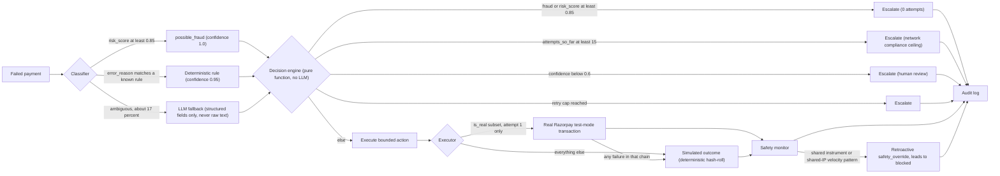

# Paymedic

An AI Revenue Recovery agent built for the **Razorpay AI Buildathon**. It detects at-risk
revenue (failed payments), classifies why each one failed, and executes a bounded, fully
audited recovery action — with hard stopping rules a real payment system is legally and
financially forced to respect, not invented ones.

## The problem

> Build an agent that detects at-risk revenue (failed payments, abandoned checkouts,
> overdue invoices) and executes a bounded recovery workflow.
> — Razorpay AI Buildathon, "AI Revenue Recovery" track

The judged bar: actual money recovered on a batch (not a cherry-picked example),
explainable/bounded/gated actions, stopping rules (max retries, no action on fraud),
a full audit trail per transaction, and at least one deliberate "the agent was wrong,
and caught itself" case.

Paymedic's scope: **payment failure → root-cause classification → bounded recovery
action → audit log**, run over a full batch, with every decision explainable after
the fact.

## Approach



- **Classification** — deterministic rules cover most transactions; an LLM only ever
  labels the ambiguous ~17%, from structured fields (error code/source/step/amount/
  attempt/latency/risk_score), **never raw free text**, and only ever emits a
  classification label — never a decision or an action.
- **Decision** — a pure function, no LLM in the loop, that only ever sees
  `(root_cause, confidence, risk_score, attempts_so_far)`. This is the sole authority
  on what happens to money.
- **Execution** — a bounded action (`retry_immediate`, `retry_with_backoff`,
  `suggest_alternate_method`, `send_reminder`) is carried out; see
  [Real vs. simulated execution](#real-vs-simulated-execution) below.
- **Safety monitor** — runs after every action, independent of that transaction's own
  outcome, and can retroactively override an already-"recovered" status.
- **Audit log** — every classification, decision, execution, and safety override is
  logged with reasoning, timestamps, and (for real transactions) the actual gateway
  response.

## Safety bounds & stopping rules

These are enforced in `backend/app/services/decision_engine.py`, independent of the
LLM, and are visible live in the dashboard's Safety Bounds panel (pulled from
`/config/rules`, not hardcoded):

| Rule | Enforcement |
|---|---|
| Fraud never auto-retried | `risk_score >= 0.85` or `root_cause == possible_fraud` → escalate, 0 attempts ever |
| Network compliance ceiling | `attempts_so_far >= 15` → escalate, citing the real Visa/Mastercard ~15-attempt/30-day reattempt-limit rule |
| Low-confidence classification | `confidence < 0.6` → escalate to human review, never guessed |
| Per-cause retry caps | e.g. `gateway_timeout` capped at 3 attempts, `card_declined` at 1 (redirect, never a same-card retry) |
| Soft/hard decline typing | hard declines (`card_declined`, `possible_fraud`) get zero same-instrument retries, explicit and citable, not just implicit |
| Cross-transaction fraud check | two independent signals — shared payment instrument, and distinct instruments sharing one IP — can retroactively block a transaction even after an individually-reasonable action already "succeeded" |

**The flagship "agent was wrong, caught itself" cases**, both always present in every
generated batch: a card-testing cluster (one instrument, 4 small-amount transactions)
that the per-transaction classifier confidently mislabels as ordinary gateway
timeouts, and a distributed variant (4 distinct instruments/customers sharing one IP)
that only the IP-based check can see. Filter the dashboard to `status=blocked` and
open any of those rows to see the full sequence: confident classification → bounded
action → apparent success → red `safety_override` card with the retroactive reasoning.

## Real vs. simulated execution

By default, every recovery action's outcome is **simulated**: a documented
success-probability table (illustrative, not measured — e.g. `gateway_timeout` at
65%/40%/20% across 3 attempts, diminishing because genuine outages don't fix on blind
retry) hashed deterministically per `(transaction_id, attempt_number)`, so re-running
a batch always reproduces the same result. No real gateway is touched.

Optionally (`RAZORPAY_EXECUTION_ENABLED=true`), a small, fixed-count subset of each
batch (default 4, netbanking, soft-decline causes only) has its **first** bounded
action attempted against a genuine Razorpay test-mode transaction instead: a real
order via the Orders API, a headless browser driven through the actual Checkout
widget and mock-bank Success/Failure page, and the outcome read back from Razorpay's
own API (not trusted from the checkout widget's client-side callback, which proved
unreliable under headless automation). Any failure anywhere in that chain — API
error, browser automation breakage, a stuck poll — falls back transparently to the
same simulated outcome every other transaction uses, so a broken/unconfigured
Razorpay account never blocks the pipeline.

This is off by default: a clean clone with no Razorpay keys behaves exactly as the
fully-simulated system always has. The dashboard visibly distinguishes the two —
a **Razorpay Verified** metric tile, and a **REAL** badge on any row/audit event
that actually completed against the real gateway — so nothing is blended invisibly.

Real candidates are processed by a **separate "Run Real Transactions" step**, kept
out of the main "Run Pipeline" batch entirely (`POST /pipeline/run` excludes
`is_real` rows; `POST /pipeline/run-real` handles only them). This is deliberate:
the ~4 real transactions each involve genuine network + browser-automation time, so
interleaving them into the main loop would make "Run Pipeline"'s timing unpredictable
exactly when the feature is on. Verified live: `POST /pipeline/run` stays at ~10s for
the other 96 transactions whether the feature is on or off; `POST /pipeline/run-real`
took ~70s for the 4 real candidates, all completing end-to-end against Razorpay's
test-mode sandbox with genuine `order_id`/`payment_id`/gateway status each time. The
"Run Real Transactions" button only appears when `RAZORPAY_EXECUTION_ENABLED=true`.

## Metrics

Frozen `seed=42` numbers, 100 transactions, fully simulated (`RAZORPAY_EXECUTION_ENABLED=false`,
the default):

| Metric | Value |
|---|---|
| ₹ Recovered | ₹10,90,085 |
| Recovery rate | 39% |
| Fraud block rate | 100% (13 fraud-labeled: 5 flagged on `risk_score`, 8 caught retroactively) |
| False-action rate | 9.88% |
| Median time-to-recovery | 48 hours |
| Outcome split | 39 recovered / 53 escalated / 8 blocked |

("Frozen" means the generation parameters are fixed — ~17% of rows route through
live LLM classification, so re-running the same seed can shift counts by roughly
±1 transaction.)

## Setup / run instructions

Requires Docker (the backend needs Python 3.12; a Playwright/Chromium base image is
used to support the optional real-execution feature).

```bash
cp .env.example .env
# fill in at least one LLM provider key (LLM_PROVIDER + its matching *_API_KEY)
# Razorpay keys are optional -- leave RAZORPAY_EXECUTION_ENABLED=false to skip

docker compose up --build
```

- Frontend: http://localhost:3000
- Backend: http://localhost:8000 (docs at `/docs`)

In the dashboard: **Generate Batch** → **Run Pipeline** → click any row for its full
audit trail. `POST /payments/generate?seed=42` reproduces the frozen batch composition
above.

Enabling real execution: set `RAZORPAY_EXECUTION_ENABLED=true` and both
`RAZORPAY_KEY_ID`/`RAZORPAY_KEY_SECRET` (test-mode keys from your Razorpay dashboard)
in `.env` before `docker compose up`. A second **Run Real Transactions** button
appears in the top bar — "Run Pipeline" stays at its usual ~10-14s (it skips the real
candidates entirely); running the real step separately takes noticeably longer
(~70s for the default 4, since each involves a genuine browser-automated checkout
against Razorpay's live test-mode sandbox) and is meant to be its own deliberate
demo beat, not a silent pause inside the main run.

### Tests

```bash
docker build -t paymedic-backend backend
docker run --rm paymedic-backend python -m pytest -q
```

## Project structure

```
backend/
  app/services/classifier.py       root-cause classification (rules + LLM fallback)
  app/services/decision_engine.py  bounded actions + stopping rules, pure function
  app/services/executor.py         simulated outcome (hash-roll)
  app/services/execution/          optional real Razorpay test-mode execution
  app/services/safety_monitor.py   retroactive cross-transaction fraud checks
  app/pipeline.py                  orchestrates classify -> decide -> execute -> audit
  app/config.py                    every threshold/flag, in one place
  scripts/generate_dataset.py      synthetic batch generation
frontend/
  app/page.tsx                     single dashboard screen
  components/                      metrics, feeds, audit trail panel, safety bounds panel
docs/PLAN.md                       phase-by-phase build record
```

## Known limitations

Stated plainly, not defensively — see `docs/PLAN.md` for the fuller history:

- The only "ground truth" (`true_root_cause`) is generated by the same code being
  evaluated — any classifier accuracy claim would be checked against the system's
  own assumptions, not an independent dataset.
- LLM confidence is self-reported, not calibrated — a wrong-but-confident answer
  passes the same gate as a right one. The system fails *closed* on outright
  failures, but has no mechanism to catch a confidently wrong success.
- Simulated execution outcomes are a documented probability table, not real retry
  semantics or real customer behavior — the real-execution feature (above) closes
  part of this gap for a small subset, not all of it.
- Per-cause retry caps (3 for `gateway_timeout`, 2 for `auth_failure`, etc.) are
  still author-chosen; only the outer network-compliance ceiling (~15 attempts) is
  a real, external, citable constraint.
- Fixed, small root-cause taxonomy (6 categories); real payment failure taxonomies
  are considerably longer-tailed.
- No auth, no multi-tenancy, single operator, single SQLite file wiped on every
  regenerate — a demo/evaluation build, not a production system.
